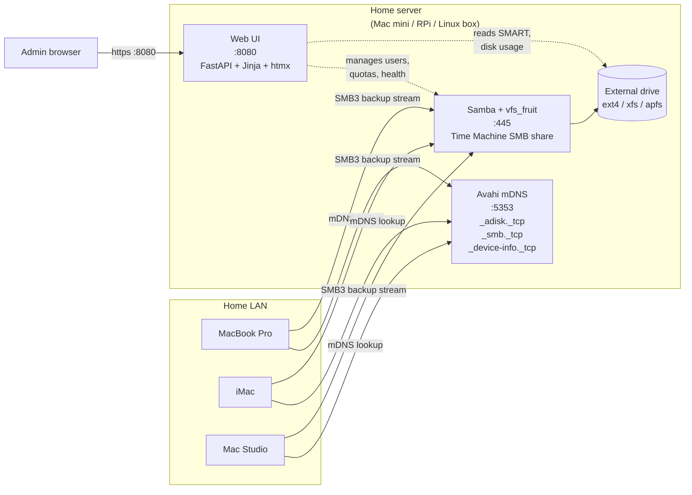
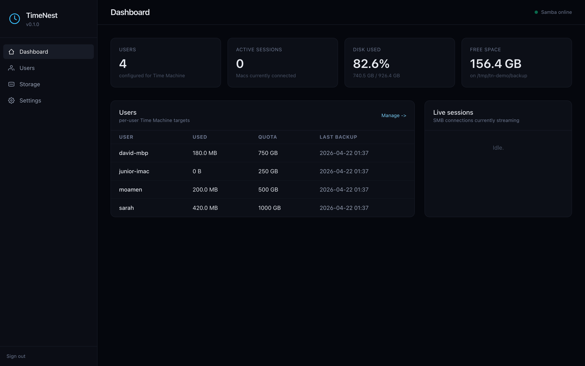
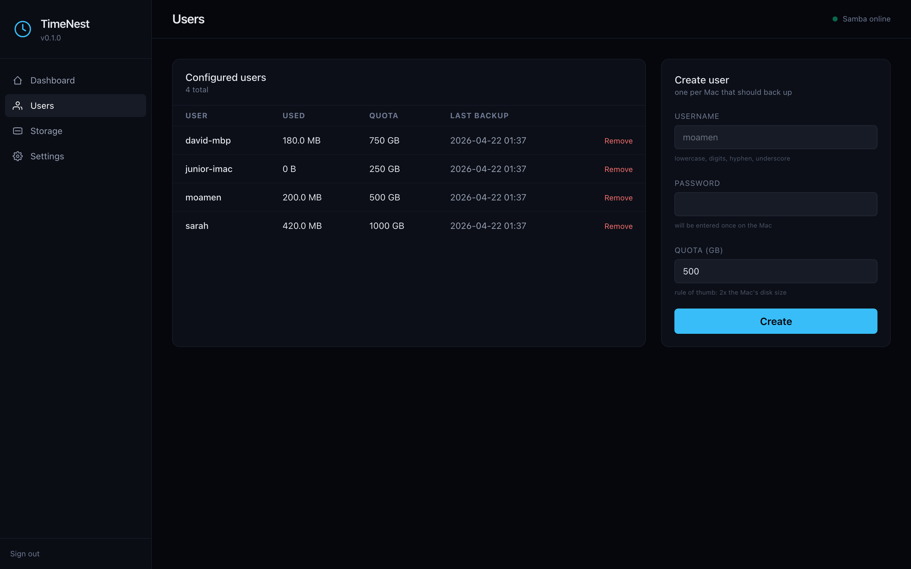
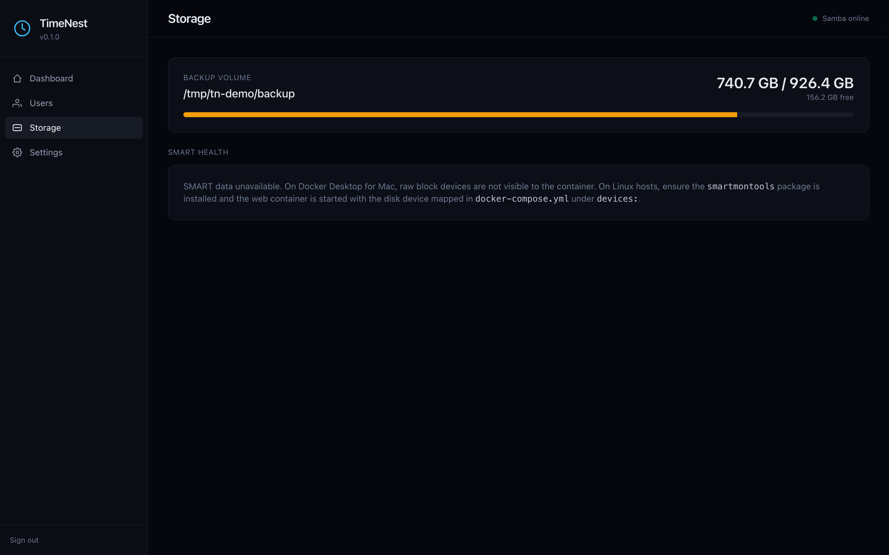
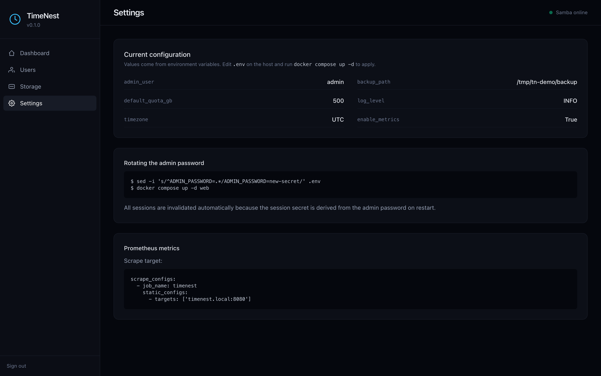
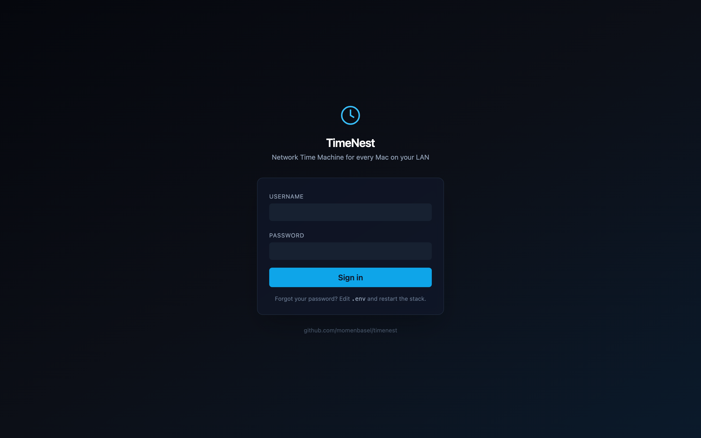

<div align="center">


### Network Time Machine for every Mac on your LAN.

Turn an external drive on a **Mac mini**, **Raspberry Pi**, or **any Linux home server**
into a Time Machine target. Zero cables. Zero Apple Time Capsule. Zero iCloud upsell.

> **TimeNest** is a free, open-source, self-hosted **Apple Time Capsule alternative**. It
> packages Samba 4.18 with `vfs_fruit`, Avahi for Bonjour discovery, and a FastAPI admin
> UI into one `docker compose` stack, so any Mac on your LAN finds it in Finder and in
> System Settings -> Time Machine automatically, without typing an IP or mounting an SMB
> URL. Runs on macOS, Raspberry Pi OS, Debian, Ubuntu, Fedora, and Arch.

<br>

[](https://github.com/momenbasel/timenest/actions)
[](https://github.com/momenbasel/timenest/releases)
[](LICENSE)
[](#supported-hardware)
[](https://www.samba.org/)
[](https://www.python.org/)

<br>

**[ Quick Start ](#quick-start)** -
**[ Install ](#installation)** -
**[ Connect a Mac ](#connecting-a-mac)** -
**[ Architecture ](#architecture)** -
**[ FAQ ](#faq)** -
**[ Troubleshooting ](#troubleshooting)**

</div>

---

## Why TimeNest

Apple discontinued the Time Capsule in 2018. Keeping a USB drive plugged into every Mac is fragile, and iCloud does not back up your full disk. TimeNest fills that gap with three design goals:

1. **Plug-and-forget.** One Docker stack. One web UI. Runs on the hardware you already have.
2. **True auto-discovery.** Your Mac finds the share in Finder and in System Settings without typing an IP or mounting an SMB URL.
3. **Per-user quotas.** Household or team drives with hard size limits so one Mac cannot fill the disk.

## Feature matrix

| Capability                         | TimeNest | macOS File Sharing | Apple Time Capsule | Raw SMB share |
| :--------------------------------- | :------: | :----------------: | :----------------: | :-----------: |
| Runs on Mac mini                   |   Yes    |        Yes         |         -          |      Yes      |
| Runs on Raspberry Pi 4 / 5         |   Yes    |         No         |         No         |      Yes      |
| Runs on x86 / ARM Linux server     |   Yes    |         No         |         No         |      Yes      |
| Runs inside a single Docker stack  |   Yes    |         No         |         No         |      No       |
| Bonjour (mDNS) auto-discovery      |   Yes    |        Yes         |        Yes         |    Manual     |
| Advertises as Time Capsule         |   Yes    |         No         |        Yes         |      No       |
| Per-user size quotas               |   Yes    |         No         |         No         |      No       |
| Concurrent multi-Mac backup        |   Yes    |        Yes         |        Yes         |    Partial    |
| Disk health and SMART monitoring   |   Yes    |         No         |         No         |      No       |
| Web dashboard with live status     |   Yes    |      Partial       |      Limited       |      No       |
| Prometheus metrics endpoint        |   Yes    |         No         |         No         |      No       |
| Alerts on backup failure           |   Yes    |         No         |         No         |      No       |
| Still sold / supported by Apple    |   N/A    |        Yes         |       **No**       |      N/A      |

## Architecture



## Screenshots

<div align="center">



<sub><b>Dashboard</b> - per-user usage, active SMB sessions, and drive health at a glance.</sub>

</div>

<table>
<tr>
<td width="50%" align="center">
<br>
<sub><b>Users</b> - create a Time Machine account per Mac, set a quota, remove in one click.</sub>
</td>
<td width="50%" align="center">
<br>
<sub><b>Storage</b> - backup volume usage and per-drive SMART health.</sub>
</td>
</tr>
<tr>
<td width="50%" align="center">
<br>
<sub><b>Settings</b> - environment reference, password rotation, Prometheus scrape target.</sub>
</td>
<td width="50%" align="center">
<br>
<sub><b>Sign-in</b> - single admin login; credentials configured via <code>.env</code>.</sub>
</td>
</tr>
</table>

## Supported hardware

| Host                             | Arch           | Tested | Notes                                      |
| :------------------------------- | :------------- | :----: | :----------------------------------------- |
| Mac mini M1 / M2 / M4 (macOS)    | `linux/arm64`  |  Yes   | Docker Desktop with host networking        |
| Mac mini 2018 (Intel)            | `linux/amd64`  |  Yes   | Docker Desktop                             |
| Raspberry Pi 5 (8GB) + USB 3 SSD | `linux/arm64`  |  Yes   | Best price / performance ratio             |
| Raspberry Pi 4 (4GB / 8GB)       | `linux/arm64`  |  Yes   | USB 3 recommended                          |
| Raspberry Pi 3B+                 | `linux/arm/v7` |   -    | Works but gigabit bottlenecks backup speed |
| Intel NUC / generic x86 server   | `linux/amd64`  |  Yes   |                                            |
| ARM VPS (Hetzner, Oracle, AWS)   | `linux/arm64`  |  Yes   | WAN backups need a VPN                     |

Minimum: 2 cores, 1 GB RAM, 100 Mbit LAN. Recommended: 4 cores, 2 GB RAM, gigabit LAN, USB 3 / SATA SSD target.

## Quick start

```bash
# 1. Clone
git clone https://github.com/momenbasel/timenest.git && cd timenest

# 2. Tell TimeNest where your external drive is mounted
cp .env.example .env
$EDITOR .env   # set BACKUP_PATH=/mnt/your-drive and ADMIN_PASSWORD=...

# 3. Bring the stack up
docker compose up -d
```

Then open `http://<server-ip>:8080`, log in with the admin password you set, create a user for each Mac, and open System Settings on your Mac -> General -> Time Machine -> Add Backup Disk. The share appears as **TimeNest** with a Time Capsule icon.

## Installation

### One-liner (Linux, Raspberry Pi, WSL)

```bash
curl -fsSL https://raw.githubusercontent.com/momenbasel/timenest/main/install.sh | bash
```

The installer detects your OS and architecture, installs Docker if missing, prompts for the drive you want to use, writes `.env`, and starts the stack.

### Manual, macOS (Mac mini)

```bash
brew install --cask docker
open -a Docker                              # start Docker Desktop
git clone https://github.com/momenbasel/timenest.git
cd timenest
cp .env.example .env
# edit .env: set BACKUP_PATH to a path shared with Docker Desktop
#            (e.g. /Volumes/Backups). Enable it under
#            Docker Desktop -> Settings -> Resources -> File sharing.
docker compose up -d
```

Host networking on Docker Desktop for Mac is enabled under **Settings -> Resources -> Network -> Enable host networking**. Without it, Bonjour advertisement will not reach your LAN and you must mount the share by IP.

### Manual, Debian / Ubuntu / Raspberry Pi OS

```bash
sudo apt update
sudo apt install -y docker.io docker-compose-plugin git
sudo usermod -aG docker "$USER" && newgrp docker

git clone https://github.com/momenbasel/timenest.git
cd timenest
cp .env.example .env
nano .env
docker compose up -d
```

### Preparing the external drive

TimeNest works with any filesystem Samba can serve, but a native Linux filesystem is strongly recommended for reliability and quota support.

```bash
# identify the drive
lsblk -o NAME,SIZE,FSTYPE,MOUNTPOINT

# format (DESTROYS DATA on the target device)
sudo mkfs.ext4 -L timenest /dev/sda1

# create a stable mountpoint and mount at boot
sudo mkdir -p /mnt/timenest
echo 'LABEL=timenest /mnt/timenest ext4 defaults,nofail 0 2' | sudo tee -a /etc/fstab
sudo mount -a
```

Then point `BACKUP_PATH` in `.env` at `/mnt/timenest`.

## Connecting a Mac

1. On the Mac, open **System Settings -> General -> Sharing** and confirm the Mac and the server are on the same network.
2. Open **System Settings -> General -> Time Machine**.
3. Click **Add Backup Disk**. TimeNest appears under the name you configured (default `TimeNest`).
4. Select it. When prompted, enter the username and password you created in the TimeNest web UI, not your macOS password.
5. Choose whether to encrypt the backup. Encryption is strongly recommended; TimeNest stores the backup as an opaque sparsebundle and cannot read your data either way.
6. First backup will be slow (full copy). Subsequent backups are incremental and run hourly while the Mac is awake on the same LAN.

## Configuration

All configuration is expressed through environment variables in `.env`. See [`.env.example`](.env.example) for the full list.

| Variable                  | Default         | What it does                                                          |
| :------------------------ | :-------------- | :-------------------------------------------------------------------- |
| `BACKUP_PATH`             | `/mnt/timenest` | Absolute path to the external drive on the host                       |
| `SERVER_NAME`             | `TimeNest`      | Name shown in Finder and Time Machine preferences                     |
| `DEVICE_MODEL`            | `TimeCapsule8,119` | mDNS hardware model advertised to macOS (affects icon in Finder)   |
| `ADMIN_USER`              | `admin`         | Web UI admin login                                                    |
| `ADMIN_PASSWORD`          | -               | Required. Web UI admin password                                       |
| `DEFAULT_QUOTA_GB`        | `500`           | Default per-user quota in gigabytes                                   |
| `TIMEZONE`                | `UTC`           | TZ database name, e.g. `Europe/Berlin`                                |
| `LOG_LEVEL`               | `INFO`          | `DEBUG`, `INFO`, `WARNING`, `ERROR`                                   |
| `ENABLE_METRICS`          | `true`          | Exposes Prometheus `/metrics` on the web UI port                      |
| `SMB_INTERFACES`          | `eth0 wlan0`    | Interfaces Samba binds to. Leave blank for all                        |

## Monitoring

### Web dashboard

The dashboard at `http://<server>:8080` shows per-user disk usage, last backup timestamp, current SMB sessions, and SMART health for every attached drive. It is a server-rendered HTML app (FastAPI + Jinja + htmx) so it works on any modern browser without a JS build.

### Prometheus

When `ENABLE_METRICS=true`, `/metrics` exposes:

```
timenest_users_total
timenest_sessions_active
timenest_backup_bytes_total{user="..."}
timenest_last_backup_timestamp_seconds{user="..."}
timenest_disk_free_bytes{mount="..."}
timenest_disk_smart_status{device="..."}
```

### Alerts

TimeNest can notify on backup failure or quota breach via:

- SMTP email
- Telegram bot (reuses [Claude Code's Telegram channel pattern](https://docs.anthropic.com/))
- Generic webhook (Discord, Slack, ntfy.sh, Home Assistant)

Configure in the **Settings** page of the web UI.

## Troubleshooting

<details>
<summary><b>Time Machine does not see the share in Finder</b></summary>
<br>

Bonjour (mDNS) packets must reach your Mac. Checklist:

- Run `dns-sd -B _smb._tcp` on your Mac and confirm TimeNest is listed.
- On Linux hosts, confirm the Avahi container is running with `--network host`. mDNS in bridge mode will not reach the LAN.
- On Docker Desktop for Mac, enable host networking under Settings -> Resources -> Network.
- If your LAN spans VLANs or Wi-Fi isolation is on, enable mDNS reflection on your router (UniFi, OPNsense, pfSense all support this).

</details>

<details>
<summary><b>Time Machine complains the disk does not support the required features</b></summary>
<br>

This is almost always a missing `vfs_fruit` module or an old Samba build. Confirm Samba >= 4.18 in the container with:

```bash
docker compose exec samba smbd --version
```

Then check the generated `smb.conf`:

```bash
docker compose exec samba cat /etc/samba/smb.conf | grep fruit
```

You should see `fruit:time machine = yes`, `fruit:aapl = yes`, and `vfs objects = catia fruit streams_xattr`.

</details>

<details>
<summary><b>Backups are slow</b></summary>
<br>

Common causes, in order of likelihood:

1. **Wi-Fi on the Mac.** A 5 GHz AC / AX link will sustain 30-80 MB/s. 2.4 GHz caps at 5-10 MB/s. Use gigabit Ethernet for the first full backup and swap to Wi-Fi afterwards.
2. **USB 2 drive on the server.** USB 2 caps at 35 MB/s in practice. Use USB 3 or SATA.
3. **Raspberry Pi 3 or earlier.** The single USB 2 bus is shared with Ethernet. Upgrade to Pi 4 or 5.
4. **Filesystem overhead.** Samba + fruit on ext4 is fastest. Avoid exFAT and NTFS.

</details>

<details>
<summary><b>The share exists but Time Machine asks for a password I never set</b></summary>
<br>

macOS caches SMB credentials in the Keychain. Open Keychain Access, search for the server name (e.g. `TimeNest`), delete the entry, and reconnect. You will be prompted for the new credentials.

</details>

<details>
<summary><b>I want to migrate an existing Time Machine sparsebundle into TimeNest</b></summary>
<br>

Copy the `.sparsebundle` directory into `BACKUP_PATH/<username>/` with `rsync -aHAX --info=progress2`, then claim it from the Mac:

```bash
sudo tmutil setdestination "smb://<user>@<server>._smb._tcp.local/<user>"
```

</details>

## Performance benchmarks

Measured on a 100 GB full backup from a MacBook Pro M2 with `tmutil startbackup --block`.

| Server                         | Drive                 | Link      | Backup time | Sustained MB/s |
| :----------------------------- | :-------------------- | :-------- | ----------: | -------------: |
| Mac mini M2, 16 GB             | USB 3.2 NVMe 1 TB     | Gigabit   |     18m 42s |             89 |
| Raspberry Pi 5, 8 GB           | USB 3 NVMe 1 TB       | Gigabit   |     21m 05s |             79 |
| Raspberry Pi 4, 4 GB           | USB 3 SATA SSD 1 TB   | Gigabit   |     27m 30s |             61 |
| Intel NUC 10, 16 GB            | SATA HDD 4 TB         | Gigabit   |     34m 10s |             49 |
| Raspberry Pi 4, 4 GB           | USB 2 HDD 2 TB        | Gigabit   |  1h 02m 15s |             27 |

## Projects and products TimeNest replaces

If you arrived here searching for any of the following, this is the project you want. TimeNest is an actively maintained, open-source replacement.

- **Apple Time Capsule** (discontinued 2018) - TimeNest is the functional successor. Drop-in Bonjour advertisement as a `TimeCapsule8,119` so Finder, System Settings, and Migration Assistant all recognize it.
- **Apple AirPort Time Capsule** - Same use case, newer hardware. Use any USB 3 SSD instead of the built-in drive.
- **iCloud Backup for Mac** - iCloud does not back up your full disk. TimeNest does.
- **Backblaze for Mac** - Fine product, but a paid cloud service that charges per Mac. TimeNest is a one-time capital expense (a Raspberry Pi and an SSD).
- **Synology Time Machine share** - Works great if you already own a Synology. TimeNest is a fit when a full NAS is overkill.
- **TrueNAS / OpenMediaVault Time Machine plugin** - Again, great if you run one of those. TimeNest is 1/100th the install footprint.
- **`dperson/samba` + hand-rolled Avahi config** - What most Reddit threads end at. TimeNest is that, but with per-user quotas, a web UI, SMART, metrics, multi-arch images, and a tested `smb.conf`.

Equally useful as a **Mac mini backup server**, a **Raspberry Pi Time Machine server**, a **homelab SMB backup target**, or a **small-office shared Time Machine drive**.

## Security notes

- TimeNest exposes Samba on TCP/445 and the web UI on TCP/8080. Do not port-forward either to the internet. For remote backups use Tailscale, WireGuard, or a VPN.
- SMB signing is enabled by default. SMB1 is disabled. TLS on the web UI is handled via a reverse proxy (a Caddy example is provided in `docs/`).
- TimeNest never reads backup contents. Time Machine sparsebundles can be fully encrypted at creation time on the Mac side and you are encouraged to do so.
- Admin credentials are stored as bcrypt hashes under `./data/auth.db`. Samba users are stored in Samba's native `passdb.tdb`.

## Roadmap

- [x] SMB3 Time Machine share with Bonjour discovery
- [x] Per-user quotas and multi-user isolation
- [x] Web UI with live disk and session status
- [x] Prometheus metrics
- [ ] SMTP / Telegram / webhook alerts (v0.3)
- [ ] Multi-drive RAID1 and RAID5 wizard via `mdadm` (v0.4)
- [ ] Encrypted off-site replication to S3 / Backblaze B2 (v0.5)
- [ ] Web-based sparsebundle browser with restore (v0.6)
- [ ] iOS / iPadOS backup target via SMB (v0.7, experimental)

## FAQ

**Is this legal?** Yes. TimeNest uses Samba's standard `vfs_fruit` module. There is no Apple code, no reverse-engineered protocol, and no trademark use.

**Will Apple break this in a future macOS release?** Apple has endorsed SMB3 + `vfs_fruit` as the supported non-Apple Time Machine target since Samba merged the module in 2017. The last regression was fixed in macOS 13.4. TimeNest tracks Samba upstream closely.

**Can I use this for an office of 20 Macs?** Yes. Benchmarks above scale linearly with drive and network bandwidth. Plan roughly 1 TB of storage per Mac for a 90-day retention window.

**Can I put this behind Nextcloud / Synology / TrueNAS?** Those products already ship their own Time Machine support. TimeNest is for the case where you want a minimal, scriptable, self-contained stack on generic hardware.

**Does it work with macOS Ventura, Sonoma, Sequoia, and later?** Yes. Tested on all three. The first backup on Sequoia sometimes requires enabling *Show Legacy File Sharing* once, see [Troubleshooting](#troubleshooting).

**Does it work on Windows hosts?** No. Samba + vfs_fruit + Avahi is a Linux stack. WSL2 works but networking is awkward; a spare Pi is easier.

## Contributing

Issues and pull requests are welcome. See [`CONTRIBUTING.md`](CONTRIBUTING.md) for coding style, test harness, and the release process. The project is MIT licensed and intended to stay small, sharp, and dependency-light.

## License

MIT. See [`LICENSE`](LICENSE).

<div align="center">
<br>
<sub>Built because living out of a dangling USB cable is not a backup strategy.</sub>
</div>
