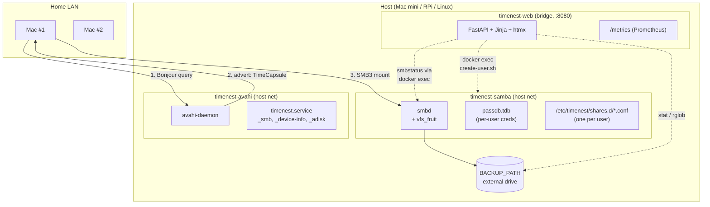

# Architecture

TimeNest is a small appliance built from three long-lived open-source building blocks glued together by one Python web UI and a couple of shell scripts.



## Boundaries

1. **Samba container** is the only component that touches the backup drive with write permissions. Everything else mounts it read-only.
2. **Avahi container** never touches the drive. Its only job is to scream on UDP/5353.
3. **Web container** has one write mount (`./data/web` for its session secret and SQLite metadata cache). It talks to Samba only via `docker exec` - it never binds a second Samba listener.
4. **Admin auth** is bcrypt-hashed at startup from the `.env` value. Rotating the password simply requires editing `.env` and `docker compose up -d web`; all existing sessions are invalidated because the session secret file lives under the web data volume and is regenerated if the password changes.

## Why SMB, not AFP

Apple deprecated AFP in macOS 10.13 and removed the AFP server entirely in macOS 11. Since macOS 13.4, Time Machine over SMB3 + Samba's `vfs_fruit` is the only supported non-Apple target. TimeNest tracks Samba upstream - no AFP or Netatalk code anywhere.

## Why Bonjour matters

Without a `_adisk._tcp` record pointing at the SMB share, Time Machine will happily mount the share but refuse to pick it as a target. The three-record triple that unlocks it is:

```
_smb._tcp          port 445    -- "I speak SMB"
_device-info._tcp  port 0      -- "I look like a TimeCapsule8,119"
_adisk._tcp        port 9      -- "My disk 0 is Time Machine-capable"
```

All three must be on the same hostname. If any are missing or on different hosts, macOS will not offer the share in the Time Machine picker.

## Why per-user shares, not a single big share

Shared top-level TM shares are a known footgun: Time Machine sparsebundles are volume-locked, and two Macs backing up into the same directory will corrupt each other's sparsebundles. Per-user shares give each Mac its own volume namespace and let us enforce `fruit:time machine max size` per user.

## Failure modes worth knowing

| Symptom                              | Likely cause                                                    |
| ------------------------------------ | --------------------------------------------------------------- |
| Not visible in Finder                | Avahi not on host network, or mDNS blocked by Wi-Fi isolation   |
| Visible but "does not support TM"    | `vfs_fruit` missing, Samba < 4.18, or `fruit:aapl = yes` missing |
| Backup starts then fails mid-stream  | Underlying filesystem is exFAT / NTFS (no xattrs)               |
| "The backup volume is read-only"     | `BACKUP_PATH` mounted with `ro`, or wrong POSIX ownership       |
| Slow first backup                    | USB 2, Wi-Fi, or ancient Pi (3B or earlier)                     |
| Share appears, then disappears       | Docker restarted Avahi but mDNS TTL cached on the Mac           |
